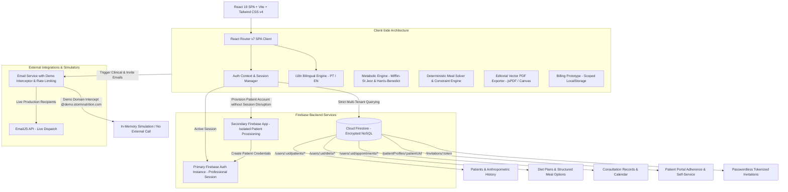

# Storm Nutrition — Clinical Management & Diet Planning Platform

[](https://github.com/Hiltonnetoo/stormnutrition/actions)
[](https://www.typescriptlang.org/)
[](https://vitest.dev/)
[](https://firebase.google.com/docs/rules)
[](https://playwright.dev/)
[](LICENSE)

Storm Nutrition is a clinical nutrition management application built with **React 19**, **TypeScript (Strict Mode)**, **Vite**, **Tailwind CSS v4**, and **Firebase** (Auth, Firestore, Storage). Designed for professional dietitians, the platform combines structured clinical assessments, a deterministic constraint-based meal planning engine powered by verified Brazilian food composition data (TACO/UNICAMP), a dedicated Patient Portal with passwordless onboarding, editorial-grade vector PDF exports, and database-enforced multi-tenant isolation.

- 🌐 **Live Demo:** [https://stormnutrition.web.app](https://stormnutrition.web.app)
- 📖 **Evaluation Guide:** [docs/demo-guide.md](docs/demo-guide.md) (3–5 min quick assessment)
- 🏛️ **Architectural Decision Records:** [docs/architecture-decisions.md](docs/architecture-decisions.md) (10 ADRs)

---

## 🏗️ Architecture Diagram



---

## 🏛️ Core Engineering & Architecture Decisions

A detailed record of all 10 architectural decisions, trade-offs, and design rationale is maintained in [docs/architecture-decisions.md](docs/architecture-decisions.md). Highlights include:

1. **React 19 & Strict TypeScript Compiler** ([ADR-01](docs/architecture-decisions.md#adr-01-react-19-spa-with-strict-typescript-and-code-splitting)): Pure SPA architecture with zero `any` evasions. Dynamic code-splitting via `React.lazy` on heavy export libraries (`html2canvas`, `jspdf`) reduces initial bundle load by **over 53%** (from 1.6 MB to ~760 KB).
2. **Compile-Time Tailwind CSS v4** ([ADR-02](docs/architecture-decisions.md#adr-02-native-compile-time-tailwind-css-v4)): Replaced legacy runtime CDN scripts with `@tailwindcss/vite`. Stylesheets compile into a single static file (~19 KB gzip) with full offline layout predictability.
3. **Secondary Firebase App for Patient Provisioning** ([ADR-03](docs/architecture-decisions.md#adr-03-secondary-firebase-auth-instance-for-non-disruptive-patient-provisioning)): Encapsulates patient credential creation in a secondary, isolated Firebase instance (`getSecondaryAuth()` in `authService.ts`), preventing the client SDK from evicting the active nutritionist's session.
4. **Passwordless Tokenized Invitations** ([ADR-04](docs/architecture-decisions.md#adr-04-passwordless-tokenized-invitations-with-patient-defined-passwords)): No cleartext or temporary passwords are transmitted via email. Patients claim their account via cryptographic invitation tokens (`/convite/:token`) and set their own passwords.
5. **Database-Enforced Multi-Tenant Isolation** ([ADR-05](docs/architecture-decisions.md#adr-05-multi-tenant-isolation-via-firestore-security-rules)): Tenant boundaries are enforced directly in `firestore.rules`. Cross-practitioner data leakage is prevented at the engine level even if clients communicate with Firestore endpoints directly.
6. **Deterministic Algorithmic Solver over Generative AI** ([ADR-06](docs/architecture-decisions.md#adr-06-deterministic-constraint-based-meal-generation-over-generative-ai)): Rule-based meal generation eliminates hallucinated macros and guarantees medical boundary compliance without API token costs or latency.
7. **Vector Editorial PDF Generation** ([ADR-07](docs/architecture-decisions.md#adr-07-vector-based-editorial-pdf-exporting)): High-resolution vector text (~50 KB) with dynamic page-budgeting calculations, preventing orphan section headers and broken tables.
8. **Decoupled Local Billing Prototype** ([ADR-08](docs/architecture-decisions.md#adr-08-architectural-decoupling-of-local-billing-simulation)): Commercial plans and subscription management run in scoped `localStorage` for demonstration purposes, explicitly disclaimed in the UI and completely independent of Firestore backend authorization.
9. **Safe Demo Email Interception** ([ADR-09](docs/architecture-decisions.md#adr-09-safe-interception-of-demo-emails-and-multi-layer-abuse-controls)): Intercepts demo domains (`@demo.stormnutrition.com`, `@example.com`, `@test.com`), preventing accidental external dispatches while keeping anti-spam rate limiting fully testable.
10. **Defensive Schema Hydration** ([ADR-10](docs/architecture-decisions.md#adr-10-v1v2-backward-compatibility-and-defensive-schema-hydration)): Adapts legacy V1 unversioned diet plans seamlessly into V2 structured options without data loss or crashes.

---

## 🧮 Domain Logic & Clinical Constraints Engine

### Metabolic Equations (BMR & TDEE)
The platform implements clinical basal energy formulas in `src/services/metabolicCalculations.ts`:

*   **Mifflin-St Jeor:**
    *   $\text{BMR}_{\text{male}} = (10 \times \text{weight}_{\text{kg}}) + (6.25 \times \text{height}_{\text{cm}}) - (5 \times \text{age}_{\text{yr}}) + 5$
    *   $\text{BMR}_{\text{female}} = (10 \times \text{weight}_{\text{kg}}) + (6.25 \times \text{height}_{\text{cm}}) - (5 \times \text{age}_{\text{yr}}) - 161$
*   **Harris-Benedict (Revised):**
    *   $\text{BMR}_{\text{male}} = 88.362 + (13.397 \times \text{weight}_{\text{kg}}) + (4.799 \times \text{height}_{\text{cm}}) - (5.677 \times \text{age}_{\text{yr}})$
    *   $\text{BMR}_{\text{female}} = 447.593 + (9.247 \times \text{weight}_{\text{kg}}) + (3.098 \times \text{height}_{\text{cm}}) - (4.330 \times \text{age}_{\text{yr}})$

Total Daily Energy Expenditure (TDEE) adjusts BMR by physical activity factors ($1.2$ for sedentary up to $1.9$ for extremely active).

### Nutritional Database & Constraint Rules
*   **Composition Data:** Built-in bilingual database containing **588+ validated food items** based on the Brazilian Food Composition Table (**TACO / UNICAMP - 4th Edition**) and national culinary items.
*   **Dietary Restrictions:** Automated query-level filtering for Gluten-free, Lactose-free, Vegetarian, Vegan, and Low FODMAP profiles.
*   **NOVA 4 Ultraprocessed Filtering:** Identifies and excludes ultra-processed food items, prioritizing in natura and minimally processed whole foods.
*   **Semaphoric Clinical Safety Badges:** Evaluates meals against clinical reference values, displaying semaphoric alerts for sodium ceilings ($< 2000\text{ mg/day}$) and high glycemic loads.

---

## 🧪 Testing & Quality Metrics (Measured September 2026)

Every critical path is validated through automated test suites operating against isolated local emulators:

| Suite | Runner / Tool | Tests | Scope & Focus |
| :--- | :--- | :--- | :--- |
| **Unit & Integration** | Vitest + jsdom | **300 passed** (37 files) | Metabolic math, deterministic solver, migrations, date logic, i18n parity, error boundaries, storage quotas, abuse controls. |
| **Security Rules** | `@firebase/rules-unit-testing` | **34 passed** (2 files) | Firestore authorization matrix: multi-tenant isolation, patient self-service limits, deletion lifecycles, and appointment access. |
| **End-to-End & A11y** | Playwright + Chromium | **14 passed** (45.7s) | Complete clinical workflows, axe-core WCAG 2.1 AA scans, keyboard tab journeys, 320px mobile reflow, PDF exports. |
| **Query Performance** | Vitest + Emulator | **Passed** | Query cost budgets: verifies zero unindexed composite queries and single-read aggregation counts. |
| **Static Analysis** | TypeScript (`tsc --noEmit`) | **0 errors** | Strict mode verification across entire codebase. |
| **Code Style & Lint** | ESLint & Prettier | **0 errors** | Clean formatting and hook dependency conformance. |
| **Production Build** | Vite 6 | **1.63s** | Optimized bundle with separate CSS and split dynamic chunks. |

---

## 🚀 Quick Evaluation & Guided Demo (3–5 Minutes)

To experience the platform immediately with synthetic clinical profiles, start the application and navigate to the [Login Screen](/login). Use the **1-Click Demo Accounts** panel:

| Synthetic Persona | Account Email | Password | Evaluation Purpose |
| :--- | :--- | :--- | :--- |
| **Dra. Clara Mendes** | `dra.clara@demo.stormnutrition.com` | `Password123!` | Primary nutritionist with active patients, clinical evolutions, and generated diet plans. |
| **Dr. Marcos Lima** | `dr.marcos@demo.stormnutrition.com` | `Password123!` | Independent practitioner with a clean workspace to verify zero data leakage between clinics. |
| **Ana Silva** | `ana.silva@demo.stormnutrition.com` | `Password123!` | Linked patient with access to the Patient Portal to view prescribed meals and log adherence. |

*For complete step-by-step guidance, follow the 5-step roadmap in [docs/demo-guide.md](docs/demo-guide.md).*

---

## 🛠️ Local Setup & Reproducible Execution

### Prerequisites
*   **Node.js:** `>= 20.0.0` (LTS v20 or v22 recommended)
*   **npm:** `>= 10.0.0`
*   **Java:** `>= 17` (required exclusively for running local Firebase emulators)

### Step-by-Step Instructions

1.  **Clone and Install Dependencies:**
    ```bash
    git clone https://github.com/Hiltonnetoo/stormnutrition.git
    cd stormnutrition
    npm install
    ```

2.  **Configure Environment Variables:**
    ```bash
    cp .env.example .env.local
    ```
    *Note: For local development with emulators, no real API keys are required. The pre-configured demo values in `.env.example` connect directly to local emulator ports.*

3.  **Start Firebase Emulators and Seed Synthetic Data:**
    ```bash
    # Starts Auth (port 9099) and Firestore (port 8080)
    npm run emulators
    
    # In a separate terminal, seed the synthetic personas and meal plans:
    npm run demo:seed
    ```

4.  **Launch the Development Server:**
    ```bash
    npm run dev
    ```
    Open `http://localhost:5000` in your browser.

5.  **Run Quality Checks & Test Suites:**
    ```bash
    npm test                    # Run 300 unit and integration tests
    npm run test:rules          # Run 34 Firestore security rules tests
    npm run test:e2e:emulated   # Run 14 Playwright E2E tests against emulators
    npm run type-check          # Verify strict TypeScript compilation
    npm run lint                # Run ESLint
    npm run format:check        # Check Prettier formatting
    npm run build               # Build production bundle
    ```

---

## 📄 Licenses & Data Attributions

*   **Application Source Code:** Distributed under the **MIT License**. See [LICENSE](LICENSE) for terms.
*   **Nutritional Composition Data:** Food item nutritional profiles are derived from the **Tabela Brasileira de Composição de Alimentos (TACO)**, 4ª edição revisada e ampliada, desenvolvida pelo Núcleo de Estudos e Pesquisas em Alimentação (NEPA), Universidade Estadual de Campinas (**UNICAMP**), Campinas - SP, Brasil. Used in accordance with academic and public research open data guidelines.
*   **UI Icons:** [Lucide Icons](https://lucide.dev/) (Licensed under ISC License).
*   **Typography:** Google Fonts — *Inter*, *Outfit*, *Silkscreen* (Licensed under SIL Open Font License 1.1).

---

## ⚠️ Disclaimers & Known Limitations

1. **Clinical Decision Support:** Storm Nutrition provides algorithmic calculation tools, reference ranges, and structured guidelines designed to assist healthcare professionals. It does not provide automated medical diagnoses or substitute direct clinical evaluation by a licensed physician or registered dietitian.
2. **Billing Simulation Prototype:** The subscription management and payment methods interfaces operate using client-side `localStorage` state (`isanutri:<uid>:billingState:v1`) for portfolio demonstration. It does not process real credit cards and is architecturally isolated from Firestore backend security rules.
3. **Safe Demonstration Emails:** Dispatches sent to demo domains (`@demo.stormnutrition.com`, `@example.com`, `@test.com`) are intercepted safely in-memory without making external API calls to EmailJS, preventing unwanted external communications.
